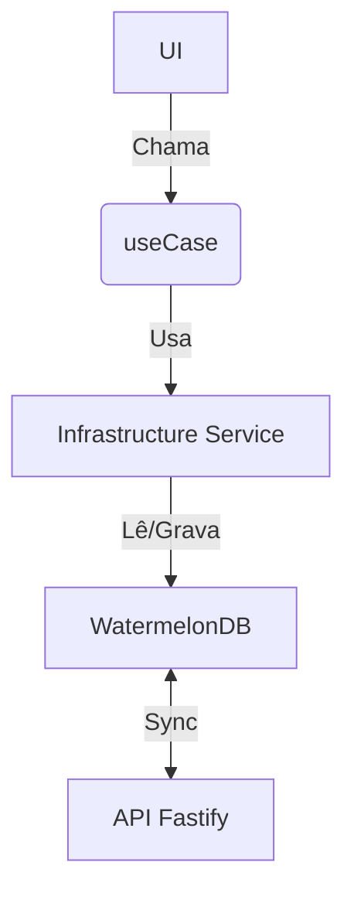
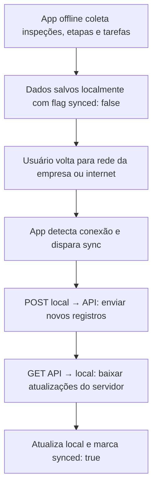

### Arquitetura do Aplicativo SaveTag

## **Visão Geral**
Estrutura **offline-first**, com sincronização **bidirecional e incremental** entre o app e a API Fastify, organizada por domínios funcionais e princípios inspirados em **SOLID**, visando manutenção e escalabilidade.

---

## **📁 Estrutura de Pastas**

### Legenda das camadas
- `core/`: Domínio puro (entidades, tipos, regras de negócio, interfaces)
- `features/`: Funcionalidades isoladas com UI, hooks e use cases
- `infrastructure/`: Integrações externas (API, DB, autenticação, device)
- `ui/`: Design system e layouts visuais
- `utils/`: Funções genéricas auxiliares

### Estrutura base
```text
src/
├── app/                     # Inicialização e páginas
├── assets/                  # Images, fonts e etc
├── core/
│   ├── types/               # Tipos compartilhados
│   ├── domain/              # Entidades e regras puras
│   └── repositories/        # Interfaces de repositórios
├── features/                # Domínios de funcionalidade
├── infrastructure/
│   ├── api/                 # Comunicação com Fastify
│   ├── database/
│   │   ├── models/          # Schemas 
│   ├── repositories/        # Implementações dos repositórios
│   ├── sync/                # Funções de sincronização
│   └── auth/                # Login, token, sessão
├── ui/                      # Componentes e temas visuais
└── utils/                   # Funções auxiliares
```

---

## **🧠 Princípios Chave**

1. **Offline-First:** Persistência garantida em ambientes sem conexão.
2. **Modularidade:** Cada feature é isolada e autocontida.
3. **Separação de Interesses:** UI não acessa domínio ou infraestrutura diretamente.
4. **Inversão de Dependência:** `core` define o contrato; `infra` implementa.

---

## **🛠️ Diretrizes por Camada**

### 1. Core (Domínio)
- Contém:
  - Entidades puras (`Inspection`, `Project`)
  - Tipos compartilhados
  - Interfaces de repositórios (`InspectionRepository`)

- Restrições:
```typescript
// ❌ Evita:
import { View } from 'react-native';
import api from '@/infrastructure/api';
```

---

### 2. Features

- Organização típica:
```text
features/
└── inspection/
    ├── useCases/
    ├── hooks/
    ├── components/
    └── services/
```

- Comunicação entre features via props ou eventos
- Use hooks para consumir casos de uso ou serviços

---

### 3. Infrastructure

- Subdivisões:
```text
infrastructure/
├── api/                 # Cliente HTTP + interceptadores
├── auth/                # Login, logout, persistência de sessão
├── database/
│   ├── models/          # Schemas WatermelonDB
│   ├── instance.ts      # Criação do DB
│   └── migrations.ts    # Evolução do schema
├── repositories/        # Implementações das interfaces de core/repositories
└── sync/                # Orquestração de sync
```

---

### 4. UI

- Contém:
  - Componentes reutilizáveis e sem lógica
  - Temas e design tokens
  - Layouts e containers básicos

---

## **🔄 Fluxo de Dados**


---

## **🔁 Sistema de Sincronização**

### Estratégia
- Executado em background ou manual
- Sincronização baseada em `updated_at` + flag `synced`

### Fases:
1. **PUSH:** Envia dados locais alterados
2. **PULL:** Atualiza local com registros novos ou alterados no servidor

### infra/sync/syncInspections.ts
```typescript
export async function syncInspections() {
  const local = await inspections.query(Q.where('synced', false)).fetch();
  await pushToApi(local);
  const updates = await api.get(`/sync/inspections?updated_since=${lastSync}`);
  await saveToDB(updates);
}
```

---

## **🔁 Fluxo Visual de Sincronização**



---

## **🔐 Sessão e Autenticação**

```text
infrastructure/
└── auth/
    ├── AuthService.ts       # Login, logout, token refresh
    ├── AuthRepository.ts    # Interface
    └── AuthStorage.ts       # Persistência local (MMKV, SecureStore)
```

- Dados do usuário persistidos localmente
- Token salvo com criptografia
- Atualização de sessão ao reconectar

---

## **⚙️ Convenções Técnicas**

### TypeScript
- ❌ Evite `any`
- 🧩 Use `type` para props
- 🧱 Use `interface` para entidades e contratos

### Testes
- Sufixo `.test.ts`
- Mocks em `__mocks__/`

### Estilo
- Hooks: `useXyz`
- Serviços: `XyzService`
- Componentes: PascalCase

---

## **🚀 Padrões de Commit**

| Prefixo  | Significado                  |
|----------|------------------------------|
| `feat:`  | Nova funcionalidade          |
| `fix:`   | Correção                     |
| `refac:` | Refatoração                  |
| `arch:`  | Mudança estrutural/arquitetura |

---

## **🔮 Evolução Futura**

### Planejado
- Uso do **Prisma Client** no mobile com WASM (investigação)
- Suporte a **formulários dinâmicos** via schema remoto

### Padrões em uso
```typescript
export const INSPECTION_STEPS = [
  { id: 1, tasks: [...] },
  { id: 2, tasks: [...] }
] as const;
```

---

## **🛑 Anti-Padrões Comuns**
```typescript
// ❌ Evitar:
export default function () {}
// ✅ Preferido:
export function useInspection() { ... }
```


